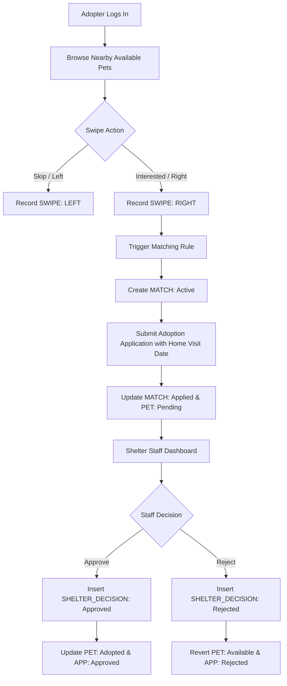

# Kinder Pets — Pet Adoption Management System

A Tinder-style pet adoption platform built for **DBMS Academic Mini-Project (DA2)**. 

Kinder Pets bridges the gap between animal shelters and prospective pet parents through an interactive discovery interface. Adopters can discover nearby pets, swipe through profiles, express interest, receive deterministic matches, submit formal adoption applications with scheduled home visits, and receive shelter staff decisions.

---

## 📌 Problem Statement

Traditional pet adoption registries suffer from high drop-off rates due to static table-based listings, lack of location awareness, and tedious manual paperwork. Potential adopters struggle to find compatible companions based on lifestyle, home space, and breed traits, while shelter staff spend excessive time triaging unqualified inquiries and manually tracking inspection visits.

---

## 🎯 Objective

1. Modernize animal adoption discovery using an intuitive swipe-based mechanism.
2. Implement an academically rigorous relational schema adhering strictly to **3NF/BCNF** with 12 normalized entities.
3. Enforce referential integrity, domain constraints, and audit trails using Oracle-compatible SQL DDL and PL/SQL stored procedures, functions, and triggers.
4. Deliver a responsive, locally-runnable web application demonstrating the complete adoption lifecycle.

---

## ✨ Features

- **🐾 Discover Feed**: Nearby pet cards featuring multiple high-resolution photos, breed traits, age, size category, temperament description, housing preferences, and shelter location.
- **🔥 Tinder-Style Swipe Deck**: Smooth card interactions with `[ ❌ Pass ]` (LEFT swipe) and `[ ❤️ Interested ]` (RIGHT swipe), plus keyboard shortcuts (`←`, `→`, `↑`).
- **🎉 Deterministic Matching**: Automatic evaluation of mutual interest creating an active record in the `MATCH` table upon right swipe.
- **📋 Adoption Application**: Direct conversion from a match into a formal application with preferred home visit dates and living environment notes.
- **🏢 Shelter Dashboard**: Staff hub to review pending applications, conduct background triage, and record formal decisions (`Approve` or `Reject`) with transactional updates to pet status (`Adopted` or `Available`).
- **⚡ Interactive SQL Lab**: Live in-browser execution panel for all 14 academic SQL queries with query concepts, syntax highlighting, and live results from the real SQL engine.
- **🔄 Instant Role Switcher**: Quick toggle between 6 realistic adopters (across Bangalore, Mumbai, Chennai, Delhi, Pune) and 6 shelter staff to test the complete workflow without re-logging in.
- **↺ 1-Click DB Reset**: Instant database re-seeding button to demonstrate clean workflows during live academic viva evaluations.

---

## 🛠️ Technology Stack

- **Frontend**: Next.js 15+ (App Router), TypeScript, Tailwind CSS
- **Backend / API**: Next.js API Routes (`/api/pets`, `/api/swipes`, `/api/matches`, `/api/applications`, `/api/decision`, `/api/queries`)
- **Database Engine (Local Dev)**: Node.js Built-in SQLite (`node:sqlite`) with foreign keys and WAL mode — **zero native compile dependencies**, works instantly out of the box.
- **Target Academic RDBMS**: Oracle Database 19c / 21c / 23ai (Full DDL, constraints, seed data, queries, and PL/SQL scripts in `/database`).

---

## 🏛️ Database Design (12 DA1 Entities)

The schema strictly implements the 12 normalized entities established in DA1:

1. **`SHELTER`** (`shelter_id` PK, `shelter_name`, `license_no`, `city`)
   - Animal welfare shelters managing rescue operations.
2. **`SHELTER_STAFF`** (`staff_id` PK, `shelter_id` FK, `staff_name`, `role`)
   - Veterinarians, coordinators, and caseworkers.
3. **`BREED`** (`breed_name` PK, `species`)
   - Master taxonomy classifying species (Dog, Cat) and recognized breeds.
4. **`PET`** (`pet_id` PK, `shelter_id` FK, `breed_name` FK, `pet_name`, `gender`, `age_months`, `size`, `behaviour_desc`, `lifestyle_desc`, `status`)
   - Available animals (`status` ∈ {'Available', 'Pending', 'Adopted', 'Fostered'}).
5. **`PET_PHOTO`** (`photo_id` PK, `pet_id` FK, `photo_url`, `is_primary`)
   - Multi-photo gallery support with primary display flag.
6. **`ADOPTER`** (`adopter_id` PK, `full_name`, `email`, `phone`, `city`, `state`)
   - Registered adopters across Indian metro cities.
7. **`ADOPTER_PREFERENCE`** (`adopter_id` PK/FK, `preferred_species`, `min_age_months`, `max_age_months`, `preferred_size`)
   - 1-to-1 extension capturing adopter preference parameters.
8. **`PREFERRED_BREED`** (`adopter_id` PK/FK, `breed_name` PK/FK)
   - Resolves the M:N relationship between adopters and multiple favorite breeds.
9. **`SWIPE`** (`swipe_id` PK, `adopter_id` FK, `pet_id` FK, `direction`, `swiped_at`)
   - User interaction log (`direction` ∈ {'LEFT', 'RIGHT'}).
10. **`MATCH`** (`match_id` PK, `adopter_id` FK, `pet_id` FK, `matched_at`, `status`)
    - Mutual affinity record (`status` ∈ {'Active', 'Applied', 'Closed'}).
11. **`ADOPTION_APPLICATION`** (`application_id` PK, `match_id` FK UNIQUE, `staff_id` FK, `home_visit_date`, `application_status`, `submitted_at`)
    - Formal request workflow (`application_status` ∈ {'Pending', 'Under Review', 'Approved', 'Rejected'}).
12. **`SHELTER_DECISION`** (`decision_id` PK, `pet_id` FK, `adopter_id` FK, `decision`, `staff_id` FK, `decided_at`)
    - Staff adjudication log (`decision` ∈ {'Approved', 'Rejected'}).

---

## 🔄 Application Workflow



---

## 💾 SQL Implementation (`database/`)

The repository includes complete, production-grade SQL scripts in `database/`:

- **`01_schema.sql`**: Oracle DDL defining all 12 tables with `VARCHAR2`, `NUMBER`, `DATE`, `TIMESTAMP`, sequences/identities, foreign keys, and check constraints.
- **`02_constraints.sql`**: Performance indexes on search keys (`status`, `breed_name`, `shelter_id`, `adopter_id`).
- **`03_seed_data.sql`**: Realistic dataset covering 5 Shelters, 6 Staff, 10 Breeds, 16 Pets, 20 Photos, 6 Adopters, Preferences, Swipes, Matches, Applications, and Decisions.
- **`04_queries.sql`**: 14 demonstration queries exercising:
  1. All available pets
  2. Available pets with 3-table join (pet, breed, shelter)
  3. Filter pets by species
  4. Filter pets by breed
  5. Adopter preference matching using subqueries and range checks
  6. Adopter swipe history
  7. Matches for an adopter
  8. Pending adoption applications
  9. Caseworker assignments (LEFT OUTER JOIN)
  10. Adopted pets audit trail (4-table join)
  11. Shelter census (GROUP BY and conditional SUM)
  12. Breed census (GROUP BY with HAVING)
  13. Application status distribution percentages
  14. Shelters with available pets using `EXISTS` subquery

---

## ⚙️ PL/SQL Implementation

Demonstrated in `database/05_procedures.sql`, `06_functions.sql`, and `07_triggers.sql`:

### Stored Procedures
- `add_pet`: Validates foreign key constraints and registers new pets.
- `record_swipe`: Upserts user swipes and evaluates deterministic matching logic.
- `submit_adoption_application`: Creates application and shifts pet status to 'Pending'.
- `approve_adoption`: Atomic transaction updating decision, application, and setting pet to 'Adopted'.
- `reject_adoption`: Atomic transaction updating decision, application, and reverting pet to 'Available'.

### User Functions
- `get_available_pet_count(shelter_id)`: Aggregates real-time inventory counts.
- `get_adopter_match_count(adopter_id)`: Returns active match count.
- `is_pet_suitable_for_adopter(adopter_id, pet_id)`: Checks species, size, and age bounds.

### Triggers
- `trg_prevent_invalid_pet_status`: Enforces state transitions (prevents direct jump to Adopted).
- `trg_decision_update_pet_status`: Cascades staff decisions directly to `PET.status`.
- `trg_prevent_duplicate_application`: Prevents duplicate pending submissions for a match.
- `trg_single_primary_photo`: Enforces single primary photo invariant.

---

## 💻 Local Setup & Execution

### Prerequisites
- Node.js 18+ (Node 20 or Node 26 supported)
- npm 9+

### Quick Start (Runs Locally in 60 seconds)
```bash
# 1. Clone or navigate into the repository
cd kinderpets

# 2. Install dependencies (if not already installed)
npm install

# 3. Start development server
npm run dev
```

Open your browser to:
👉 **`http://localhost:3000`**

The database (`kinderpets.db`) is automatically initialized and seeded with all 12 tables and demonstration records on first launch.

---

## 📂 Project Structure

```
kinderpets/
├── app/
│   ├── api/
│   │   ├── adopters/route.ts      # Adopters & metadata API
│   │   ├── applications/route.ts  # Adoption application submission & queries
│   │   ├── decision/route.ts      # Shelter staff adjudication API
│   │   ├── matches/route.ts       # Adopter matches API
│   │   ├── pets/route.ts          # Pet discovery & registration API
│   │   ├── queries/route.ts       # Live academic SQL runner API
│   │   ├── reset/route.ts         # Database reset to seed API
│   │   └── swipes/route.ts        # Swipe recording & matching API
│   ├── favicon.ico
│   ├── globals.css                # Tailwind CSS styling
│   ├── layout.tsx                 # Root layout & page metadata
│   └── page.tsx                   # Master interactive client application
├── components/
│   ├── ApplicationModal.tsx       # Adoption application modal
│   ├── ApplicationsView.tsx       # Adopter applications tracker view
│   ├── DiscoverView.tsx           # Feed view (Swipe Deck or Card Grid)
│   ├── MatchCelebrationModal.tsx  # Interactive Match popup celebration
│   ├── MatchesView.tsx            # Adopter matches list & action view
│   ├── Navbar.tsx                 # Navigation bar & user/role switcher
│   ├── PetCard.tsx                # Card component with age/distance badges
│   ├── PetDetailModal.tsx         # Multi-photo gallery & details modal
│   ├── ShelterDashboard.tsx       # Staff hub for applications & inventory
│   ├── SqlLab.tsx                 # 14 Academic SQL queries & PL/SQL viewer
│   └── SwipeDeck.tsx              # Tinder card deck with keyboard controls
├── database/
│   ├── 01_schema.sql              # Oracle DDL for 12 tables
│   ├── 02_constraints.sql         # B-tree indexes & check constraints
│   ├── 03_seed_data.sql           # Realistic Indian shelters & pets seed data
│   ├── 04_queries.sql             # 14 Academic DBMS queries
│   ├── 05_procedures.sql          # PL/SQL stored procedures
│   ├── 06_functions.sql           # PL/SQL user-defined functions
│   ├── 07_triggers.sql            # PL/SQL database triggers
│   └── README.md                  # Oracle database setup & execution guide
├── docs/
│   └── da2/
│       └── report_notes.md        # Viva questions, 3NF analysis, report notes
├── lib/
│   ├── db.ts                      # Local SQLite database service & SQL engine
│   └── types.ts                   # TypeScript interfaces for all 12 DA1 entities
├── package.json
└── README.md
```

---

## 🎯 DA2 Demonstration Checklist

Follow this exact sequence during your demonstration to your professor:

1. **Discover & Filters**:
   - Open `http://localhost:3000`.
   - Show available pets in Bangalore near **Rahul Sharma**.
   - Filter by **Species: Dog**, **Size: Large**, **Radius: Nearby**.
2. **Tinder-Style Swipe**:
   - Switch to **Tinder Swipe** view.
   - Click `[ ❌ Pass ]` on a pet (demonstrates `SWIPE` record with direction `LEFT`).
   - Click `[ ❤️ Interested ]` on **Bruno** (Labrador).
   - Show the celebration popup: **"It's a Match!"** (demonstrates deterministic `MATCH` insertion).
3. **Matches & Application**:
   - Click **Matches** in the navbar.
   - Click **Apply for Adoption** on Bruno.
   - Select a Home Visit Date (e.g. next week) and submit.
   - Show status transition to `Pending`.
4. **Shelter Dashboard Adjudication**:
   - Use the top-right user switcher to switch to **Dr. Rajesh Rao (Paws & Tails, BLR)**.
   - Open **Shelter Hub**.
   - Locate the pending application for Bruno from Rahul Sharma.
   - Click **`[ ✅ Approve Adoption ]`**.
   - Explain that this runs the atomic transaction: records into `SHELTER_DECISION`, updates `ADOPTION_APPLICATION` to `Approved`, and sets `PET.status` to `Adopted`.
5. **SQL Lab Demonstration**:
   - Click **SQL Lab** in the navbar.
   - Select Query 2 (3-Table Join) and show live output.
   - Select Query 5 (Adopter preference matching).
   - Select Query 11 (Shelter census with conditional SUM).
   - Switch to the **PL/SQL Programs** tab to explain procedures, functions, and triggers from the code files in `/database`.
